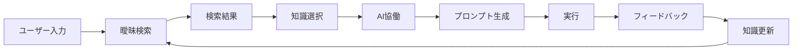

# PromptForge 詳細設計書

## 1. システム概要

### 1.1 目的
生成AI/LLMに関する知識を人間とAIの両方が活用しやすい形で管理し、実践的なプロンプト作成を支援するアプリケーション

### 1.2 コンセプト
「鍛冶場（Forge）」のように、生の知識を実用的なプロンプトへと鍛え上げる場所

## 2. システムアーキテクチャ

```
┌─────────────────────────────────────────────┐
│            PromptForge Frontend             │
│  ┌─────────┐ ┌──────────┐ ┌─────────────┐ │
│  │ Search  │ │Knowledge │ │ AI Assistant│ │
│  │ Engine  │ │ Editor   │ │ Interface   │ │
│  └─────────┘ └──────────┘ └─────────────┘ │
└─────────────────────────────────────────────┘
                      │
┌─────────────────────────────────────────────┐
│            Application Layer                 │
│  ┌─────────┐ ┌──────────┐ ┌─────────────┐ │
│  │ Fuzzy   │ │Knowledge │ │ AI Service  │ │
│  │ Search  │ │ Manager  │ │ Connector   │ │
│  └─────────┘ └──────────┘ └─────────────┘ │
└─────────────────────────────────────────────┘
                      │
┌─────────────────────────────────────────────┐
│              Data Layer                      │
│  ┌─────────────────┐ ┌──────────────────┐  │
│  │  Local Storage  │ │  Cloud Storage   │  │
│  │  (IndexedDB)    │ │  (Optional)      │  │
│  └─────────────────┘ └──────────────────┘  │
└─────────────────────────────────────────────┘
```

## 3. 詳細機能仕様

### 3.1 知識管理機能

#### データモデル

```typescript
interface KnowledgeItem {
  id: string;
  metadata: {
    createdAt: Date;
    updatedAt: Date;
    version: number;
  };
  
  // 人間向けデータ
  humanReadable: {
    title: string;
    description: string;
    personalNotes: string;
    tags: string[];
    usageScenarios: string[];
    examples: Example[];
  };
  
  // AI向けデータ
  aiReadable: {
    technique: string;
    category: string;
    template: string;
    parameters: Record<string, any>;
    constraints: string[];
    effectiveness: EffectivenessMetrics;
  };
  
  // 使用統計
  usage: {
    count: number;
    lastUsed: Date;
    successRate: number;
    contexts: UsageContext[];
  };
  
  // 関連情報
  relations: {
    relatedTechniques: string[];
    prerequisites: string[];
    alternatives: string[];
  };
}
```

### 3.2 曖昧検索エンジン

#### 検索アルゴリズム実装

```typescript
class FuzzySearchEngine {
  private asearch: AsearchLib;
  private searchIndex: SearchIndex;
  
  constructor() {
    this.initializeIndex();
  }
  
  search(query: string, options?: SearchOptions): SearchResult[] {
    // 複数フィールドでの曖昧検索
    const results = this.searchInFields(query, [
      'title',
      'tags',
      'description',
      'technique'
    ]);
    
    // スコアリング
    return this.rankResults(results, {
      textMatch: 0.4,
      usageFrequency: 0.3,
      recency: 0.2,
      contextRelevance: 0.1
    });
  }
  
  private searchInFields(query: string, fields: string[]): RawResult[] {
    return fields.flatMap(field => 
      this.asearch.match(query, this.searchIndex[field])
    );
  }
}
```

### 3.3 AI協働インターフェース

#### プロンプト生成支援

```typescript
interface AIAssistant {
  // 知識ベースを参照したプロンプト提案
  suggestPrompt(context: {
    task: string;
    requirements: string[];
    knowledgeBase: KnowledgeItem[];
  }): Promise<PromptSuggestion[]>;
  
  // 実行結果のフィードバック処理
  processFeeback(feedback: {
    prompt: string;
    result: string;
    satisfaction: number;
  }): Promise<void>;
  
  // 新しい知識の抽出
  extractKnowledge(conversation: {
    messages: Message[];
  }): Promise<KnowledgeItem[]>;
}
```

## 4. ユーザーインターフェース詳細

### 4.1 メイン画面コンポーネント

```typescript
// 検索バー
interface SearchBar {
  placeholder: "プロンプトテクニックを検索...";
  fuzzySearch: boolean;
  realtimeResults: boolean;
  searchHistory: string[];
}

// 知識カード
interface KnowledgeCard {
  title: string;
  tags: Tag[];
  usageCount: number;
  lastUsed: string;
  quickActions: {
    use: () => void;
    edit: () => void;
    askAI: () => void;
  };
}

// フィルターパネル
interface FilterPanel {
  categories: Category[];
  tags: Tag[];
  dateRange: DateRange;
  usageFrequency: Range;
}
```

### 4.2 知識エディター

```typescript
interface KnowledgeEditor {
  // デュアルペインエディター
  humanPane: {
    title: TextField;
    description: TextArea;
    examples: ExampleList;
    tags: TagInput;
  };
  
  aiPane: {
    template: CodeEditor;
    parameters: JSONEditor;
    validation: ValidationPanel;
  };
  
  // プレビュー機能
  preview: {
    showExample: boolean;
    testPrompt: string;
    testResult: string;
  };
}
```

## 5. データフロー



## 6. 実装優先順位

### Phase 1: MVP（最小実装）

- 基本的な知識登録・編集
- 曖昧検索機能
- ローカルストレージ

### Phase 2: AI連携

- AI API接続
- プロンプト提案機能
- フィードバックループ

### Phase 3: 高度な機能

- 知識の可視化
- チーム共有機能
- 分析ダッシュボード


